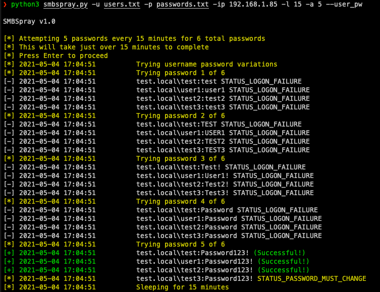
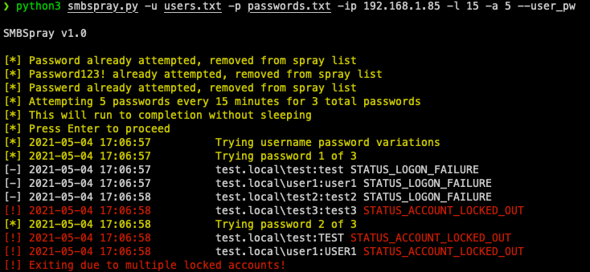

# smbspray
A smarter SMB password sprayer with customizable options

**Version 1.2**

```
SMBSpray v1.2

usage: smbspray.py [-h] [-u users] [-U user] [-p passwords] [-P password] [-d domain] [-l minutes] [-a attempts] -ip IP/hostname [--threads threads] [--verbose] [--user_pw][--unsafe]

Parse Spray Arguments.

optional arguments:
  -h, --help         show this help message and exit
  -u users           User list to spray
  -U user            Single user to spray
  -p passwords       Password list to spray
  -P password        Single password to spray
  -d domain          Domain
  -l minutes         Lockout policy period in minutes (Default: 30 minutes)
  -a attempts        Number of attempts per lockout period (Default: 1 attempt)
  -ip IP/hostname    IP/hostname to spray
  --threads threads  Number of threads to run (Default: 5 threads)
  --verbose          Verbose Mode
  --user_pw          Try username variations as password
  --unsafe           Keep spraying even if there are multiple account lockouts
  ```


## Basic Usage/Features

To pass smbspray a list of users and passwords use the `-u` and `-p` options. Alternatively, you can specify `-U` for a single user or `-P` for a single password.

The domain is optional as smbspray will attempt to automatically get it from the server specified with `-ip`, but can also be specified with `-d`. NetBIOS name also works.

By default smbspray will attempt one password every 30 minutes, this can be tuned with the `-l` option for how often you want to spray and also `-a` for how many attempts per period you want to try. So if you want to do 5 attempts every 15 minutes do `-l 15 -a 5`. To be extra safe in case you mess this up, there is an prompt to confirm before proceeding.

Also by default, smbspray will kill the current spraying session if 3 accounts are detected as locked out, this can be overriden with `--unsafe` if you wish to yolo spray.

`--user_pw` will try a few common username variations as the password which includes the username all lowercase, all uppercase, and captalized with an `!`. So if a username is bob it'll try `bob`, `BOB`, and `Bob!`.

Three log files get written to the current directory:
* `spray_logs.txt` - log of all attempts with timestamps
* `valid_creds.txt` - valid credentials
* `attempted_pws.txt` - passwords attempted

Once a password has been tried for all users, it'll get written to `attempted_pws.txt`. So if you start up a new session and try to respray the same password, it prevents it from being sprayed again to try to be more efficient.

Putting this all together you can do something like:



An example of sprayed passwords being removed and exiting when locked account threshold is met:



## Credits

* [Impacket](https://github.com/SecureAuthCorp/impacket) - for doing the heavy lifting
* [CrackMapExec](https://github.com/byt3bl33d3r/CrackMapExec) - for inspiration and some example code
